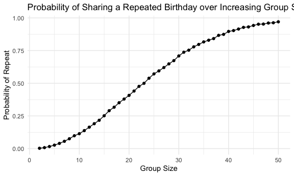
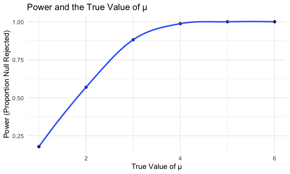
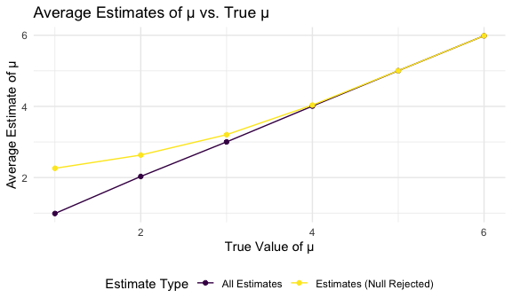
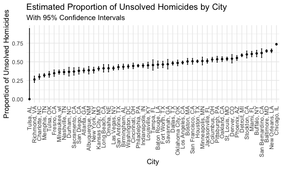

p8105_hw5_yh3824
================
ruby
2025-11-11

load packages/set formatting

``` r
library(tidyverse)
library(rvest)

knitr::opts_chunk$set(
  fig.width = 6,
  fig.asp = .6,
  out.width = "90%"
)

theme_set(theme_minimal() + theme(legend.position = "bottom"))

options(
  ggplot2.continuous.colour = "viridis",
  ggplot2.continuous.fill = "viridis"
)

scale_colour_discrete = scale_colour_viridis_d
scale_fill_discrete = scale_fill_viridis_d

set.seed(1)
```

## Problem 1

make a function for birthday simulation

``` r
bday_sim = function(n_room) {
  
  birthdays = sample(1:365, n_room, replace = TRUE)


repeated_bday = length(unique(birthdays)) < n_room

repeated_bday
  
}
```

test out the function

``` r
bday_sim(25)
```

    ## [1] TRUE

iterate

``` r
bday_sim_results = 
  expand_grid(
    bdays = 2:50,
    iter = 1:10000
  ) |> 
  mutate(
    result = map_lgl(bdays, bday_sim)
  ) |> 
  group_by(bdays) |> 
  summarize(
    prob_repeat = mean(result)
  )
```

Make a plot

``` r
bday_sim_results |> 
  ggplot(aes(x = bdays, y = prob_repeat)) +
  geom_point() +
  geom_line() +
  labs(
    x = "Group Size", 
    y = "Probability of Repeat",
    title = "Probability of Sharing a Repeated Birthday over Increasing Group Size"
  )
```



### Comments

This plot shows us that as the probability of sharing a repeated
birthday increases as the sample group increases. This is as expected as
the more people who are sampled, the more likely there will be at least
2 people who share the same birthday. At around 23-24 is when we see the
probability exceeding 50%, which demonstrates the birthday paradox.

## Problem 2

for mu = 0

``` r
powermu_zero = 
  expand_grid(
    sample_n = 30,
    sample_sd = 5,
    mu = 0,
    iter = 1:5000
  ) |> 
  mutate(data = map(iter, ~rnorm(sample_n, mean = mu, sd = sample_sd))) |> 
  mutate(tidy = map(data, ~broom::tidy(t.test(.x, mu = 0)))) |> 
  mutate(mu_hat = map_dbl(tidy, "estimate"),
         p_value = map_dbl(tidy, "p.value"))
```

for mu = {1,2,3,4,5,6}

``` r
power_sim = 
  expand_grid(
    mu = 1:6, 
    iter = 1:5000) |> 
  mutate(
    data = map(mu, ~ rnorm(n = 30, mean = .x, sd = 5)),
    ttest = map(data, ~broom::tidy(t.test(.x, mu = 0)))
    
  ) |> 
  unnest(ttest) |> 
  select(mu, iter, estimate, p.value)
```

make a plot for proportion of times the null was rejected (power) and
the true value of mu

``` r
power_sim |> 
  group_by(mu) |> 
  summarize(
    power = mean(p.value < 0.05)
  ) |> 
  ggplot(aes(x = mu, y = power)) +
  geom_point() +
  geom_smooth(se = FALSE) +
  labs(
  x = "True Value of μ",
  y = "Power (Proportion Null Rejected)",
  title = "Power and the True Value of μ"
)
```



### Comments

This plot shows that the power of the test increases as the true value
of μ increases. When μ is close to the null (0), the test rarely rejects
the null, resulting in low power. As μ increases, the effect becomes
easier to detect, and the probability of rejecting the null increases.

make a plot with avg estimate of mu and true value of mu

``` r
power_sim |> 
  group_by(mu) |> 
  summarize(
    avg_est = mean(estimate),
    avg_est_rejectnull = mean(estimate[p.value < 0.05], na.rm = TRUE)
  ) |> 
  pivot_longer(cols = c(avg_est, avg_est_rejectnull),
               names_to = "type",
               values_to = "value") |> 
  ggplot(aes(x = mu, y = value, color = type)) +
  geom_line() +
  geom_point() +
  scale_color_viridis_d(labels = c("All Estimates", "Estimates (Null Rejected)")) +
  labs(
    x = "True Value of μ",
    y = "Average Estimate of μ",
    color = "Estimate Type",
    title = "Average Estimates of μ vs. True μ"
  )
```



### Comments

Across the samples, the average estimate of mu_hat is reasonably similar
to the true value of mu, reflecting an unbiased estimator. However, when
looking only at samples where the null was rejected, the average mu_hat
is larger for smaller true mu values. This could be because as mu
becomes larger, the probability of the test rejecting the null is
higher, so the average estimate would match up closer to the true mu.

## Problem 3

import homicide-csv data

``` r
homicide_df = read_csv(file = "./data/homicide-data.csv")
```

### Description of the Raw Data

The `homicide_df` dataset has 52179 observations, with 12 variables. The
dataset describes homicides in 50 large U.S. cities that occurred
between approximately 2007-2017. It includes information including where
the homicide occurred, the victim name, race, sex, and age. It also
includes disposition of the homicide - if it is Open/no arrest, closed
by arrest, and closed without arrest.

Create a `city_state` variable

``` r
homicide_df = 
  homicide_df |> 
    mutate(
      city_state = paste(city, state, sep = ", ")
    ) 
```

write a `summarize_homicides` function that summarizes the total
homicides, and total unsolved homicides

``` r
summarize_homicides = function(df, disposition_col = "disposition",
                                unsolved_values = c("Closed without arrest", "Open/No arrest")) {
  
  df |> 
    summarize(
      total_homicide = n(),
      unsolved_homicide = sum(.data[[disposition_col]] %in% unsolved_values)
    )
}
```

For the city of Baltimore, MD, pull the estimate proportions and CI of
unsolved homicides

``` r
baltimore_proptest = 
  homicide_df |> 
  filter(city_state == "Baltimore, MD") |> 
  summarize_homicides() |> 
 (\(df) prop.test(
    x = pull(df, unsolved_homicide),
    n = pull(df, total_homicide)
  ))() |> 
  broom::tidy() |> 
  select(estimate, conf.low, conf.high)

baltimore_proptest |> 
  knitr::kable(digits = 2)
```

| estimate | conf.low | conf.high |
|---------:|---------:|----------:|
|     0.65 |     0.63 |      0.66 |

Pull proportion of unsolved homicides, and CI across all cities

``` r
city_proptest = 
  homicide_df |> 
  group_by(city_state) |> 
  summarize_homicides() |> 
  mutate(
    test_result = map2(
      unsolved_homicide,
      total_homicide, ~ prop.test(.x, .y)  |>  
    broom::tidy())) |> 
  unnest(test_result) |> 
  select(city_state, estimate, conf.low, conf.high)
```

    ## Warning: There was 1 warning in `mutate()`.
    ## ℹ In argument: `test_result = map2(...)`.
    ## Caused by warning in `prop.test()`:
    ## ! Chi-squared approximation may be incorrect

``` r
city_proptest |> 
  knitr::kable(digits = 2)
```

| city_state         | estimate | conf.low | conf.high |
|:-------------------|---------:|---------:|----------:|
| Albuquerque, NM    |     0.39 |     0.34 |      0.44 |
| Atlanta, GA        |     0.38 |     0.35 |      0.41 |
| Baltimore, MD      |     0.65 |     0.63 |      0.66 |
| Baton Rouge, LA    |     0.46 |     0.41 |      0.51 |
| Birmingham, AL     |     0.43 |     0.40 |      0.47 |
| Boston, MA         |     0.50 |     0.46 |      0.55 |
| Buffalo, NY        |     0.61 |     0.57 |      0.65 |
| Charlotte, NC      |     0.30 |     0.27 |      0.34 |
| Chicago, IL        |     0.74 |     0.72 |      0.75 |
| Cincinnati, OH     |     0.45 |     0.41 |      0.48 |
| Columbus, OH       |     0.53 |     0.50 |      0.56 |
| Dallas, TX         |     0.48 |     0.46 |      0.51 |
| Denver, CO         |     0.54 |     0.48 |      0.60 |
| Detroit, MI        |     0.59 |     0.57 |      0.61 |
| Durham, NC         |     0.37 |     0.31 |      0.43 |
| Fort Worth, TX     |     0.46 |     0.42 |      0.51 |
| Fresno, CA         |     0.35 |     0.31 |      0.39 |
| Houston, TX        |     0.51 |     0.49 |      0.53 |
| Indianapolis, IN   |     0.45 |     0.42 |      0.48 |
| Jacksonville, FL   |     0.51 |     0.48 |      0.54 |
| Kansas City, MO    |     0.41 |     0.38 |      0.44 |
| Las Vegas, NV      |     0.41 |     0.39 |      0.44 |
| Long Beach, CA     |     0.41 |     0.36 |      0.46 |
| Los Angeles, CA    |     0.49 |     0.47 |      0.51 |
| Louisville, KY     |     0.45 |     0.41 |      0.49 |
| Memphis, TN        |     0.32 |     0.30 |      0.34 |
| Miami, FL          |     0.60 |     0.57 |      0.64 |
| Milwaukee, wI      |     0.36 |     0.33 |      0.39 |
| Minneapolis, MN    |     0.51 |     0.46 |      0.56 |
| Nashville, TN      |     0.36 |     0.33 |      0.40 |
| New Orleans, LA    |     0.65 |     0.62 |      0.67 |
| New York, NY       |     0.39 |     0.35 |      0.43 |
| Oakland, CA        |     0.54 |     0.50 |      0.57 |
| Oklahoma City, OK  |     0.49 |     0.45 |      0.52 |
| Omaha, NE          |     0.41 |     0.37 |      0.46 |
| Philadelphia, PA   |     0.45 |     0.43 |      0.47 |
| Phoenix, AZ        |     0.55 |     0.52 |      0.58 |
| Pittsburgh, PA     |     0.53 |     0.49 |      0.57 |
| Richmond, VA       |     0.26 |     0.22 |      0.31 |
| Sacramento, CA     |     0.37 |     0.32 |      0.42 |
| San Antonio, TX    |     0.43 |     0.39 |      0.46 |
| San Bernardino, CA |     0.62 |     0.56 |      0.68 |
| San Diego, CA      |     0.38 |     0.34 |      0.43 |
| San Francisco, CA  |     0.51 |     0.47 |      0.55 |
| Savannah, GA       |     0.47 |     0.40 |      0.53 |
| St. Louis, MO      |     0.54 |     0.52 |      0.56 |
| Stockton, CA       |     0.60 |     0.55 |      0.64 |
| Tampa, FL          |     0.46 |     0.39 |      0.53 |
| Tulsa, AL          |     0.00 |     0.00 |      0.95 |
| Tulsa, OK          |     0.33 |     0.29 |      0.37 |
| Washington, DC     |     0.44 |     0.41 |      0.46 |

create a plot

``` r
city_proptest |> 
    arrange(estimate) |> 
    mutate(
      city_state = factor(city_state, levels = city_state)
      ) |> 
    ggplot(aes(x = city_state, y = estimate)) +
    geom_point(size = 1) +                      
    geom_errorbar(aes(ymin = conf.low, ymax = conf.high),       
                  width = 0.2) +
    labs(
      x = "City",
      y = "Proportion of Unsolved Homicides",
      title = "Estimated Proportion of Unsolved Homicides by City",
      subtitle = "With 95% Confidence Intervals"
    ) +
    theme(axis.text.x = element_text(angle = 90, hjust = 1, vjust = 0.5))
```



### Comments

Proportion of unsolved homicides is highest in Chicago, IL, and the
lowest in Richmond, VA. (Tulsa, AL is the lowest at 0, this might be an
error in the dataset)
